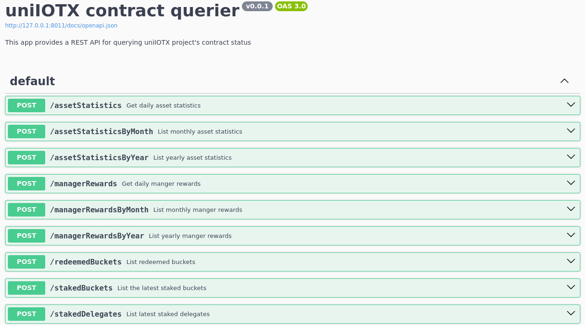

# uniiotx-querier
RESTful API for querying [uniiotx](https://github.com/Bedrock-Technology/uniiotx) project's contract status

## Build App
Ensure you have [Golang](https://go.dev/) installed beforehand. Then, from the `./app` directory,
run the command `go build -o uniiotx`. An executable file named 'uniiotx' should then appear in the `./app` directory.

## Run App
After the Dune API key has been prepared and the app has been built into the `./app` directory,
you can run the app from the `./app` directory with necessary flags using the following command.

```
./uniiotx \
    --devMode=false \
    
    --logFileName="./log.log" \
    --consoleEncoder=false \
    --stacktrace=true \
    
    --dataServerAddr="0.0.0.0:8011" \
    --metricServerAddr="0.0.0.0:7000" \
    
    --sqliteDSN="./sqlite.db" \
        
    --chainHost="https://babel-api.mainnet.iotex.io" \
    
    --systemstaking="0x68db92a6a78a39dcaff1745da9e89e230ef49d3d" \
    --iotxstaking="0x2c914Ba874D94090Ba0E6F56790bb8Eb6D4C7e5f" \
    --iotxClear="0x7AD800771743F4e29f55235A55895273035FB546" \
```

Alternatively, you can start it using a terminal multiplexer such as [Tmux](https://github.com/tmux/tmux/wiki):  
To start a new session, use this command: `tmux new-session -d -s uniiotx ./uniiotx`.  
To attach to the session just created, use this command: `tmux attach -t uniiotx`.

Please don't forget to provide the flag values as needed. Note you can run directly with `./uniiotx` if you use the above configuration, which uses default values.

## View Logs
After setting the flag `--logFileName=./log.log`, you can utilize the [Logfile Navigator](https://lnav.org/) to monitor
and analyze log files from a terminal.   
From the directory where the `log.log` file is located, execute the command: `lnav .`.   
For additional information, refer to the [lnav's documentation](https://lnav.org/docs).

## Close App
You can signal the process to terminate gracefully with the following command: `pkill -SIGTERM uniiotx`.

## Flags Info
For more information on flags, navigate to the `./app` directory and run the command `./uniiotx -h`.

```
An app provides a REST API for querying uniIOTX project's contract status

Usage:
  app [flags]

Flags:
      --chainHost string          The blockchain host for RPC communication (default "https://babel-api.mainnet.iotex.io")
      --consoleEncoder            Indicate whether to log with console encoder
      --dataServerAddr string     Address to be used by data server (default "0.0.0.0:8011")
      --devMode                   Indicate whether to run in development mode
  -h, --help                      help for app
      --iotxClear string          The address of IOTXClear contract (default "0x7AD800771743F4e29f55235A55895273035FB546")
      --iotxstaking string        The address of IOTXStaking contract (default "0x2c914Ba874D94090Ba0E6F56790bb8Eb6D4C7e5f")
      --logFileName string        The file to which logs will be written. If left empty, logs will print to stderr and stdout (default "./log.log")
      --metricServerAddr string   Address to be used by metric server (default "0.0.0.0:7000")
      --sqliteDSN string          Sqlite data source name (default "./sqlite.db")
      --stacktrace                Indicate whether to log with stacktrace (default true)
      --systemstaking string      The address of SystemStaking contract (default "0x68db92a6a78a39dcaff1745da9e89e230ef49d3d")
```
## API Info
This app serves business data in JSON format, following the style of a RESTful API.
The API implementation can be found from [./interactors](https://github.com/Bedrock-Technology/uniiotx-querier/tree/main/interactors) directory
and are served at this endpoint by default: http://0.0.0.0:8011/docs.



## Metrics Info
The following [Prometheus metrics](https://github.com/Bedrock-Technology/uniiotx-querier/tree/main/metrics) are supported
and are served at this endpoint by default: http://0.0.0.0:7000/metrics.

| Name                     | Help                                                      |
|--------------------------|-----------------------------------------------------------|
| uniiotx_staked_delegates | The number of staked delegates at specified bucket level. |
| uniiotx_staked_buckets   | The number of staked buckets at specified bucket level.   |
| uniiotx_redeemed_buckets | The number of redeemed buckets.                           |
| uniiotx_asset_statistics | The statistics of assets info.                            |


### Package Contents
The table below briefly describes the contents of each package.

| Package       | Description                                                                                                                    |
|---------------|--------------------------------------------------------------------------------------------------------------------------------|
| ./abis        | Contains ABIs of smart contracts in the [uniiotx](https://github.com/Bedrock-Technology/uniiotx) codebase.                     |
| ./app         | Contains entrance of this app, where flags of CMD are defined.                                                                 |
| ./bindings    | Contains Golang bindings of ABIs mentioned above for interaction with smart contracts.                                         |
| ./common      | Contains common elements that are shared across packages of this project.                                                      |
| ./config      | Contains configuration definition of this App.                                                                                 |
| ./docs        | Contains documents related to this project.                                                                                    |
| ./interactors | Contains use case interactors for data service in accordance with framework [swaggest/rest](https://github.com/swaggest/rest). | 
| ./logger      | Contains MyLogger, a customized & structured logger class based on zap.Logger.                                                 |
| ./metrics     | Contains Prometheus metrics that are exposed by this App, including cache metrics.                                             |
| ./poller      | Contains a Poller that is designed to synchronize contract status periodically.                                                |
| ./servers     | Contains servers of this App, including data server and metric server.                                                         |
| ./storer      | Contains MyStorer which is used to store data with SQLite database.                                                            |
| ./utils       | Contains utility functions that are reusable across the project.                                                               |
